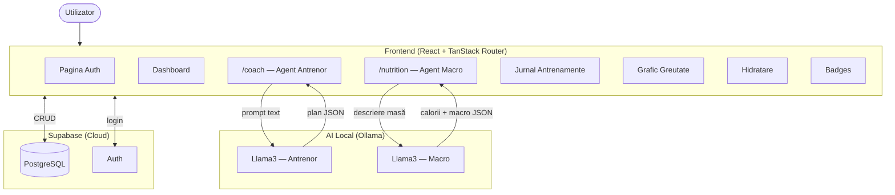

# Arhitectura SmartSpotter AI

## Diagrama componentelor

## Flow Agent Antrenor
1. Utilizatorul descrie contextul în `/coach`
2. Frontend POST → `localhost:11434/api/generate`
3. Llama3 răspunde cu JSON: `{title, exercises[], notes}`
4. Utilizatorul salvează planul → Supabase

## Flow Agent Nutriție
1. Utilizatorul scrie ce a mâncat în `/nutrition`
2. Frontend POST → `localhost:11434/api/generate`
3. Llama3 extrage: `{calories, protein_g, carbs_g, fat_g}`
4. Datele se salvează → apar în dashboard