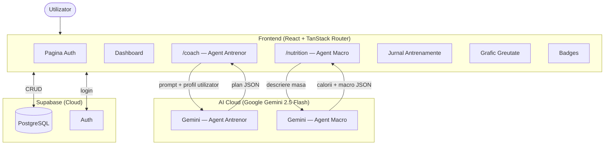

# Arhitectura SmartSpotter AI

## Diagrama componentelor

## Flow Agent Antrenor
1. Utilizatorul descrie contextul in `/coach`
2. Frontend POST → `generativelanguage.googleapis.com/v1beta/models/gemini-2.5-flash`
3. Promptul include profilul complet al utilizatorului (varsta, greutate, obiectiv, nivel activitate)
4. Gemini raspunde cu JSON: `{title, duration_min, notes, exercises[]}`
5. Utilizatorul salveaza planul → Supabase

## Flow Agent Nutritie
1. Utilizatorul scrie ce a mancat in `/nutrition`
2. Frontend POST → `generativelanguage.googleapis.com/v1beta/models/gemini-2.5-flash`
3. Promptul cere respectarea formulei Atwater: calories = protein_g*4 + carbs_g*4 + fat_g*9
4. Gemini extrage: `{calories, protein_g, carbs_g, fat_g}`
5. Datele se salveaza → apar in dashboard